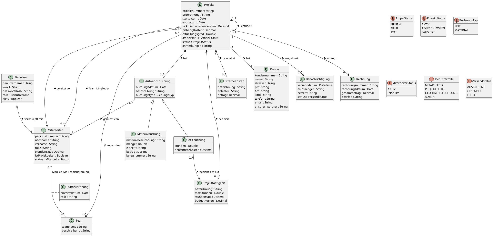

# Domänenklassendiagramm

Das Domänenklassendiagramm modelliert den **fachlichen Problembereich** ohne
technische Implementierungsdetails. Kern ist die Klasse `Projekt` mit rekursiver
Unterprojekt-Beziehung.

## Klassenübersicht

| Klasse | Beschreibung |
|---|---|
| **Projekt** | Zentrale Klasse. Selbstbeziehung ermöglicht beliebig tiefe Unterprojekte. Enthält finanzielle Kennzahlen, Termine und Ampelstatus. |
| **Aufwandsbuchung** | Abstrakte Superklasse für Zeit- und Materialbuchungen. Beide erhöhen `bisherigKosten` des Projekts. |
| **Zeitbuchung** | Erfasst Arbeitsstunden eines Mitarbeiters für eine Tätigkeit. |
| **Materialbuchung** | Erfasst Sachkosten mit Menge, Einheit und Betrag. |
| **Projekttaetigkeit** | Definiert Tätigkeitspositionen mit max. Stunden und Stundensatz (Budget-Referenz). |
| **ExterneKosten** | Kosten externer Dienstleister als feste Kostenposition ohne Mitarbeiterbezug. |
| **Mitarbeiter** | Unternehmens-Mitarbeiter. Bei Austritt: Status `INAKTIV` statt Löschung. Flag `istProjektleiter` steuert Berechtigung. |
| **Team** | Mitarbeitergruppe, die als Einheit Projekten zugewiesen werden kann. |
| **Teamzuordnung** | Assoziationsklasse zwischen Mitarbeiter und Team (Eintrittsdatum, Rolle). |
| **Kunde** | Auftraggeber. Adress- und Kontaktdaten fließen in Rechnungserstellung ein. |
| **Benutzer** | Systemzugang, verknüpft mit genau einem Mitarbeiter. Rolle steuert alle Zugriffsberechtigungen. |
| **Benachrichtigung** | Protokolliert ausgehende E-Mails. Versandstatus ermöglicht Wiederholung bei Fehlern. |
| **Rechnung** | Automatisch bei Projektabschluss erzeugt. Enthält aggregierte Kostenpositionen und PDF-Referenz. |

---

## Diagramm

## Diagrammbeschreibung

Das Domänenklassendiagramm modelliert den fachlichen Problembereich der Best-Pro-Software
**ohne technische Implementierungsdetails**. Es zeigt ausschließlich fachlich relevante
Klassen, ihre Attribute und die Beziehungen zwischen ihnen. Methoden sind bewusst nicht
dargestellt.

### Zentrale Klasse Projekt

Das `Projekt` steht im Mittelpunkt des gesamten Datenmodells. Es besitzt eine **rekursive
Kompositionsbeziehung** zu sich selbst (`0..1` zu `0..*`), was die beliebig tiefe
Verschachtelung von Unterprojekten ermöglicht. Ein Projekt ohne übergeordnetes Projekt
ist ein Wurzelprojekt.

Jedes Projekt ist:

- genau **einem Kunden** zugeordnet (1:1)
- von genau **einem Mitarbeiter** geleitet
- optional mit **mehreren Teams und einzelnen Mitarbeitern** verknüpft

Die Attribute `kalkulierteGesamtkosten`, `bisherigKosten` und `erfuellungsgrad` bilden
die rechnerische Grundlage für das Ampelsystem.

### Kostenpositionen

Einem Projekt sind drei verschiedene Arten von Kostenpositionen zugeordnet:

| Art | Klasse | Beschreibung |
|---|---|---|
| Stundenbudget | `Projekttaetigkeit` | Definiert `maxStunden × stundensatz` als Budget-Referenz für Zeitbuchungen |
| Dienstleister | `ExterneKosten` | Pauschalbeträge externer Rechnungen, kein Mitarbeiterbezug |
| Mitarbeiteraktionen | `Aufwandsbuchung` | Abstrakte Superklasse, konkretisiert als `Zeitbuchung` oder `Materialbuchung` |

Sowohl `Zeitbuchung` (Stunden × Stundensatz) als auch `Materialbuchung` (Sachkosten mit
Belegnummer) erhöhen die `bisherigenKosten` des Projekts.

### Mitarbeiter und Teams

Ein Mitarbeiter kann mehreren Teams angehören (**n:m-Beziehung**), abgebildet durch die
Assoziationsklasse `Teamzuordnung` mit eigenem `eintrittsdatum` und `rolle`.

Das Attribut `istProjektleiter` steuert, ob ein Mitarbeiter Projekte anlegen darf.
Ausgeschiedene Mitarbeiter erhalten den Status `INAKTIV` — sie werden **nicht gelöscht**,
damit historische Buchungen erhalten bleiben.

### Benutzer und Berechtigungen

Die Klasse `Benutzer` repräsentiert den Systemzugang und ist genau einem `Mitarbeiter`
zugeordnet. Die Benutzerrolle (`Enum`: `MITARBEITER`, `PROJEKTLEITER`, `GESCHAEFTSFUEHRUNG`,
`ADMIN`) steuert alle Zugriffsberechtigungen.

!!! info "Trennung Mitarbeiter / Benutzer"
    Durch diese Trennung ist es möglich, dass ein Mitarbeiter **existiert, ohne Systemzugang**
    zu haben — zum Beispiel als historischer Datensatz oder vor der Benutzeranlage durch
    den Administrator.

### Automatisierte Klassen

- **`Benachrichtigung`** protokolliert alle ausgehenden E-Mails und ermöglicht durch den
  `VersandStatus` (`AUSSTEHEND`, `GESENDET`, `FEHLER`) eine Wiederholungslogik.
- **`Rechnung`** wird bei Projektabschluss automatisch erzeugt und referenziert die
  generierte PDF-Datei über einen Dateipfad (`pdfPfad`).

---

## Enumerationen

| Enum | Werte | Verwendung |
|---|---|---|
| `AmpelStatus` | `GRUEN`, `GELB`, `ROT` | Projektstatus-Anzeige |
| `ProjektStatus` | `AKTIV`, `ABGESCHLOSSEN`, `PAUSIERT` | Projektlebenszyklus |
| `BuchungsTyp` | `ZEIT`, `MATERIAL` | Buchungsunterscheidung |
| `MitarbeiterStatus` | `AKTIV`, `INAKTIV` | Soft-Delete für Mitarbeiter |
| `Benutzerrolle` | `MITARBEITER`, `PROJEKTLEITER`, `GESCHAEFTSFUEHRUNG`, `ADMIN` | Zugriffssteuerung |
| `VersandStatus` | `AUSSTEHEND`, `GESENDET`, `FEHLER` | E-Mail-Tracking |
