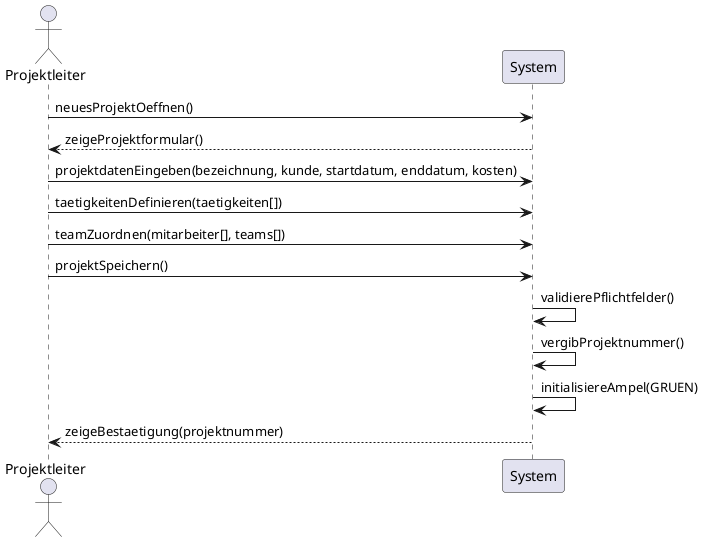
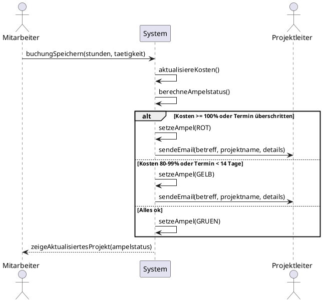
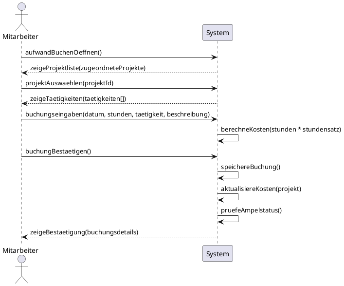
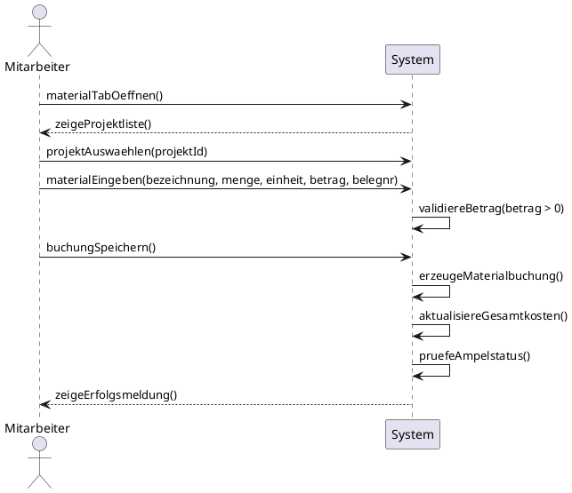
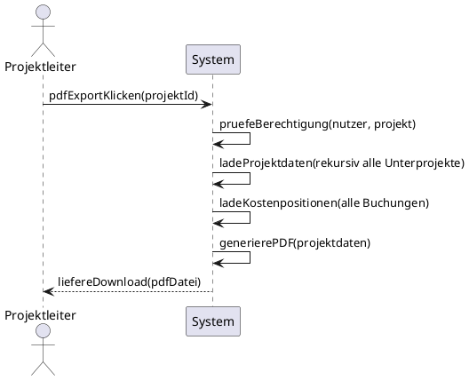
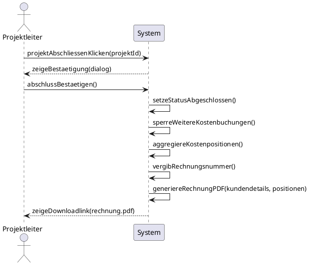
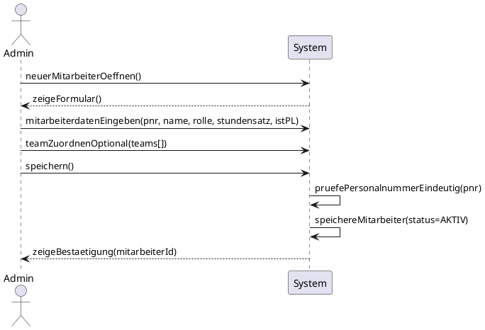
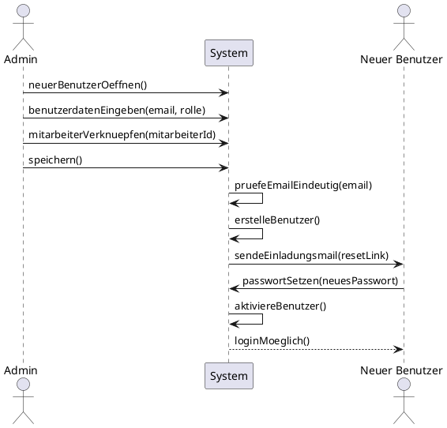
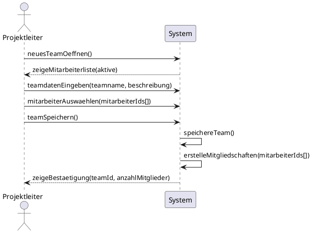
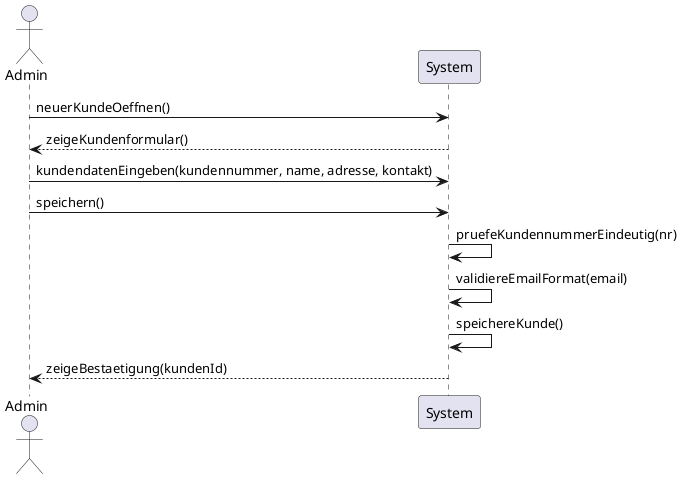

# Systemsequenzdiagramme (SSD)

Die zehn Systemsequenzdiagramme zeigen die Interaktion zwischen Akteuren
und dem System auf hoher Abstraktionsebene. Interne Systemdetails werden
**nicht** dargestellt.

---

## SSD-01 – Projekt anlegen {#ssd-01}

> **Verantwortlich:** Mitglied 1

Zeigt die Interaktion beim Anlegen eines neuen Projekts. Das System validiert
die Eingaben, vergibt eine Projektnummer und initialisiert den Ampelstatus.

!!! note "Leseanleitung"
    Das Diagramm liest sich von oben nach unten als zeitlicher Ablauf. Der Projektleiter
    eröffnet den Dialog mit `neuesProjektOeffnen()`. Das System antwortet mit dem Anzeigeformular.
    Anschließend übergibt der Nutzer in drei aufeinanderfolgenden Nachrichten die Stammdaten,
    Tätigkeiten und Teamzuordnungen. Nach dem Speicheraufruf führt das System intern drei
    Aktionen aus (erkennbar an den Selbst-Nachrichten `SYS→SYS`): Pflichtfeldvalidierung,
    automatische Projektnummernvergabe und Initialisierung des Ampelstatus auf `GRÜN`. Erst
    dann wird der Projektleiter mit einer Bestätigungsnachricht informiert. Der gestrichelte
    Rückpfeil kennzeichnet jeweils eine Systemantwort.

---

## SSD-02 – Ampelstatus prüfen & E-Mail senden {#ssd-02}

> **Verantwortlich:** Mitglied 1

Beschreibt den automatischen Prozess nach jeder Kostenbuchung: System berechnet
Kosten- und Terminfortschritt, setzt Ampelstatus und sendet ggf. Warn-E-Mail.

!!! note "Leseanleitung"
    Dieses Diagramm zeigt **drei Akteure gleichzeitig**: Mitarbeiter (Auslöser), System
    (Verarbeiter) und Projektleiter (Empfänger). Besonders zu beachten ist der `alt`-Block
    (alternatives Fragment), der drei mögliche Pfade darstellt:

    - **Rot-Zweig:** Kosten ≥ 100 % oder Termin überschritten → Ampel auf ROT, sofortiger E-Mail-Versand
    - **Gelb-Zweig:** Kosten 80–99 % oder Termin < 14 Tage → Ampel auf GELB, E-Mail-Versand
    - **Grün-Zweig (else):** Alles im Rahmen → Ampel bleibt GRÜN, keine E-Mail

    Das Diagramm verdeutlicht, dass der Projektleiter **keine aktive Rolle** spielt, sondern
    lediglich als Nachrichtenempfänger erscheint.

---

## SSD-03 – Aufwand (Zeit) buchen {#ssd-03}

> **Verantwortlich:** Mitglied 2

Ein Mitarbeiter bucht geleistete Arbeitsstunden. Das System berechnet die
Kosten und aktualisiert den Projektstand.

!!! note "Leseanleitung"
    Das Diagramm ist **zweigeteilt**: Die erste Hälfte (bis `buchungBestaetigen`) stellt den
    interaktiven Teil dar, in dem der Mitarbeiter schrittweise Projekt, Tätigkeit und
    Buchungsdaten auswählt — das System antwortet jeweils mit den verfügbaren Optionen
    (z. B. Tätigkeitsliste). In der zweiten Hälfte folgen vier interne Systemaktionen
    (`SYS→SYS`): Kostenberechnung (`Stunden × Stundensatz`), Persistierung der Buchung,
    Aktualisierung der Projektkosten und Ampelstatusüberprüfung. Eine einzelne Buchungsaktion
    löst somit eine ganze Kette von Systemreaktionen aus.

---

## SSD-04 – Materialbuchung erfassen {#ssd-04}

> **Verantwortlich:** Mitglied 2

Ein Mitarbeiter bucht Materialkosten. Der Ablauf unterscheidet sich von der
Zeitbuchung durch fehlende Tätigkeitsauswahl und direkte Kostenangabe.

!!! note "Leseanleitung"
    Im Vergleich zu SSD-03 entfällt die **Tätigkeitsauswahl**, da Materialkosten nicht an
    eine definierte Tätigkeit gebunden sind, sondern direkt als Eurobetrag erfasst werden.
    Das Diagramm zeigt, dass das System vor dem Speichern eine Betragvalidierung durchführt
    (`validiereBetrag > 0`) — eine der wenigen explizit sichtbaren Validierungsregeln auf
    Systemebene. Der anschließende interne Ablauf ist identisch mit SSD-03: Buchung speichern,
    Gesamtkosten aktualisieren, Ampelstatus prüfen.

---

## SSD-05 – PDF-Projektübersicht exportieren {#ssd-05}

> **Verantwortlich:** Mitglied 3

Der Nutzer exportiert eine vollständige Projektübersicht als PDF. Das System
sammelt rekursiv alle Unterprojekte und Kostenpositionen.

!!! note "Leseanleitung"
    Auffällig ist, dass **fast alle Aktionen** als Selbst-Nachrichten (`SYS→SYS`) erscheinen:
    Das System prüft zunächst die Berechtigung des anfragenden Nutzers, lädt danach rekursiv
    alle Unterprojektdaten und schließlich alle Kostenpositionen. Erst nach diesen
    Vorbereitungsschritten wird der PDF-Generator aufgerufen. Der Nutzer sieht lediglich
    den Auslöse-Klick und den finalen Download-Link. Das Diagramm verdeutlicht, dass die
    PDF-Generierung für komplexe Projekthierarchien mehrere interne Ladeschritte erfordert.

---

## SSD-06 – Projekt abschließen & Rechnung erstellen {#ssd-06}

> **Verantwortlich:** Mitglied 3

Der Projektleiter schließt ein Projekt ab. Das System bestätigt den Abschluss,
sperrt weitere Buchungen und erstellt automatisch eine Kundenrechnung als PDF.

!!! note "Leseanleitung"
    Das Diagramm zeigt ein explizites **Bestätigungsmuster**: Nach dem ersten Klick des
    Projektleiters antwortet das System mit einem Bestätigungsdialog, bevor der eigentliche
    Abschluss erfolgt. Erst nach der zweiten Bestätigung folgt die Kette der Systemaktionen:
    Status setzen → Buchungen sperren → Kostenpositionen aggregieren → Rechnungsnummer
    vergeben → PDF erzeugen. Dieser zweistufige Ablauf **schützt vor versehentlichem
    Abschluss**. Das Diagramm zeigt außerdem, dass die Rechnungserstellung keine separate
    Nutzeraktion erfordert, sondern automatisch und atomar mit dem Abschluss erfolgt.

---

## SSD-07 – Mitarbeiter anlegen {#ssd-07}

> **Verantwortlich:** Mitglied 4

Ein Administrator legt einen neuen Mitarbeiter an. Das System prüft die
Eindeutigkeit der Personalnummer und speichert den Datensatz.

!!! note "Leseanleitung"
    Das Diagramm unterscheidet **zwei Eingabephasen**: Zuerst die Pflichtdaten
    (Personalnummer, Name, Rolle, Stundensatz, Projektleiter-Flag), dann optional die
    Teamzuordnung. Die kritische Systemlogik ist die Prüfung der Personalnummer auf
    Eindeutigkeit (`pruefePersonalnummerEindeutig`), die vor dem Speichern erfolgt. Erst
    wenn diese Prüfung positiv ausfällt, wird der Mitarbeiter mit Status `AKTIV` persistiert.
    Das Diagramm zeigt bewusst **keinen Fehlerfall** — Systemsequenzdiagramme stellen
    typischerweise den Erfolgsfall dar; Fehlerfälle sind in der UC-Schablone beschrieben.

---

## SSD-08 – Benutzer anlegen & Rolle zuweisen {#ssd-08}

> **Verantwortlich:** Mitglied 4

Ein Administrator richtet einen Systemzugang ein, weist die Benutzerrolle zu
und das System versendet eine Einladungsmail.

!!! note "Leseanleitung"
    Dieses Diagramm stellt als einziges einen **asynchronen Prozess über zwei Sitzungen**
    hinweg dar: die Benutzeranlage durch den Administrator und die spätere Passwort-Festlegung
    durch den neuen Nutzer. Nach dem Speichern durch den Administrator durchläuft das System
    intern zwei Schritte (E-Mail-Prüfung, Benutzer erstellen), bevor es eine Einladungsmail
    sendet. Die letzten drei Nachrichten repräsentieren eine **zeitlich spätere, separate
    Aktion**: Der neue Nutzer folgt dem Link, setzt sein Passwort und wird danach aktiviert.
    Dieser Zeitsprung ist bewusst im selben Diagramm dargestellt, um den vollständigen
    Onboarding-Prozess abzubilden.

---

## SSD-09 – Team anlegen und Mitarbeiter zuordnen {#ssd-09}

> **Verantwortlich:** Mitglied 5

Ein Projektleiter erstellt ein neues Team und weist Mitarbeiter zu.

!!! note "Leseanleitung"
    Das Diagramm beginnt mit der Systemreaktion auf den Öffnungsdialog: Das System liefert
    die Liste aller **aktiven** Mitarbeiter. Der Projektleiter übergibt Teamname, Beschreibung
    und die gewählten Mitarbeiter-IDs als Array. Intern erzeugt das System das Team und
    erstellt danach für jeden Mitarbeiter einzeln eine Mitgliedschaft
    (`erstelleMitgliedschaften` mit Array). Die Bestätigungsnachricht enthält bewusst die
    **Anzahl der Mitglieder**, damit der Nutzer sofort sieht, ob alle gewünschten Zuordnungen
    erfolgreich waren.

---

## SSD-10 – Kunden anlegen {#ssd-10}

> **Verantwortlich:** Mitglied 5

Ein Administrator legt einen neuen Kunden an. Der Kunde steht danach
in der Projektanlage zur Auswahl bereit.

!!! note "Leseanleitung"
    Der strukturell einfachste der zehn Abläufe verdeutlicht dennoch zwei wichtige
    systemseitige Validierungsschritte: Das System führt vor dem Speichern **zwei parallele
    Prüfungen** durch — die Eindeutigkeit der Kundennummer und die Korrektheit des
    E-Mail-Formats. Erst wenn beide Validierungen positiv ausfallen, wird der Kunde
    persistiert. Der kompakte Aufbau dieses Diagramms spiegelt die vergleichsweise einfache
    Fachlichkeit der Kundenverwaltung wider, die **keine komplexen Folgeaktionen** wie
    Rechnungsgenerierung oder Ampelprüfung auslöst.

