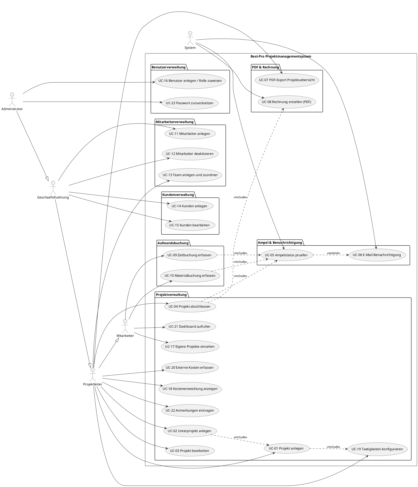

# Use-Case-Übersicht

Alle 23 identifizierten Anwendungsfälle, abgeleitet aus der Projektbeschreibung.
Sie decken alle Funktionsbereiche vollständig ab.

## UC-Tabelle

| Nr. | Name | Akteure | Priorität | Detail |
|---|---|---|---|---|
| **UC-01** | Projekt anlegen | Projektleiter, GF | 🔴 Hoch | [→](use-case-details.md#uc-01) |
| **UC-02** | Unterprojekt anlegen | Projektleiter, GF | 🔴 Hoch | |
| **UC-03** | Projekt bearbeiten | Projektleiter, GF | 🔴 Hoch | |
| **UC-04** | Projekt abschließen | Projektleiter | 🔴 Hoch | |
| **UC-05** | Projektstatus überwachen (Ampelsystem) | System, Projektleiter | 🔴 Hoch | [→](use-case-details.md#uc-05) |
| **UC-06** | E-Mail-Benachrichtigung senden | System | 🔴 Hoch | |
| **UC-07** | Projektübersicht als PDF exportieren | PL, GF, Mitarbeiter | 🔴 Hoch | [→](use-case-details.md#uc-07) |
| **UC-08** | Rechnung erstellen (PDF) | Projektleiter, System | 🔴 Hoch | [→](use-case-details.md#uc-08) |
| **UC-09** | Aufwand buchen (Zeit) | Mitarbeiter | 🔴 Hoch | [→](use-case-details.md#uc-09) |
| **UC-10** | Materialkosten buchen | Mitarbeiter | 🔴 Hoch | [→](use-case-details.md#uc-10) |
| **UC-11** | Mitarbeiter anlegen | GF, Admin | 🔴 Hoch | [→](use-case-details.md#uc-11) |
| **UC-12** | Mitarbeiter deaktivieren | GF, Admin | 🟡 Mittel | |
| **UC-13** | Team anlegen und Mitarbeiter zuordnen | Projektleiter, GF | 🟡 Mittel | [→](use-case-details.md#uc-13) |
| **UC-14** | Kunden anlegen | GF, Admin | 🔴 Hoch | [→](use-case-details.md#uc-14) |
| **UC-15** | Kunden bearbeiten | GF, Admin | 🟡 Mittel | |
| **UC-16** | Benutzer anlegen / Rolle zuweisen | Admin | 🔴 Hoch | [→](use-case-details.md#uc-16) |
| **UC-17** | Eigene Projektdaten einsehen | Mitarbeiter | 🟡 Mittel | |
| **UC-18** | Kostenentwicklung anzeigen | Projektleiter, GF | 🟡 Mittel | |
| **UC-19** | Projekttätigkeiten konfigurieren | Projektleiter | 🔴 Hoch | |
| **UC-20** | Externe Dienstleisterkosten erfassen | Projektleiter, GF | 🟡 Mittel | |
| **UC-21** | Dashboard / Projektübersicht aufrufen | Alle Nutzer | 🔴 Hoch | |
| **UC-22** | Anmerkungen zum Projekt eintragen | Projektleiter | 🟢 Niedrig | |
| **UC-23** | Passwort zurücksetzen | Admin, Nutzer | 🟢 Niedrig | |

## Priorisierungszusammenfassung

| Priorität | Anzahl | Use Cases |
|---|---|---|
| 🔴 **Hoch** | 14 | UC-01–11, UC-14, UC-16, UC-19, UC-21 |
| 🟡 **Mittel** | 7 | UC-12, UC-13, UC-15, UC-17, UC-18, UC-20 |
| 🟢 **Niedrig** | 2 | UC-22, UC-23 |

---

## Anwendungsfalldiagramm

Das folgende UML-Use-Case-Diagramm visualisiert alle Anwendungsfälle, ihre Akteure und
die wichtigsten Beziehungen (`<<include>>` / `<<extend>>`).

### Diagrammbeschreibung

**Akteure und ihre Rollen**

Das System kennt vier menschliche Akteure und einen technischen Akteur, die über
eine Generalisierungshierarchie (Vererbungspfeile `--|>`) miteinander verbunden sind:

- **Mitarbeiter** ist der Basisakteur mit den geringsten Rechten — er kann ausschließlich
  Buchungen vornehmen und eigene Projektdaten einsehen.
- **Projektleiter** erbt alle Rechte des Mitarbeiters und erhält zusätzlich Zugriff auf
  die gesamte Projektverwaltung: Anlegen, Bearbeiten, Abschließen, PDF-Export und
  Team-Verwaltung.
- **Geschäftsführung** erbt alle Rechte des Projektleiters und darf darüber hinaus
  Kunden und Mitarbeiter verwalten.
- **Administrator** besitzt alle Rechte und ist zusätzlich für Benutzerverwaltung und
  Passwortverwaltung zuständig.
- **System** übernimmt automatisierte Aufgaben: Ampelprüfung, E-Mail-Versand und
  Rechnungsgenerierung.

**Pakete und thematische Zuordnungen**

Das Diagramm ist in **sieben Pakete** (Swimlanes) gegliedert, die je einen Funktionsbereich
repräsentieren. Das Paket *Projektverwaltung* bildet mit zehn Use Cases den größten Block.
*Aufwandsbuchung* enthält die beiden Buchungs-UCs für Zeit und Material.
*Mitarbeiterverwaltung* und *Kundenverwaltung* sind der Geschäftsführung vorbehalten.
*Benutzerverwaltung* ist dem Administrator zugeordnet.

**`<<include>>`- und `<<extend>>`-Beziehungen**

Gestrichelte Pfeile mit Stereotyp kennzeichnen Abhängigkeiten zwischen Use Cases:

| Beziehung | Typ | Bedeutung |
|---|---|---|
| UC-04 → UC-08 | `<<include>>` | Projektabschluss **erzwingt** Rechnungserstellung |
| UC-04 → UC-05 | `<<include>>` | Projektabschluss **erzwingt** Ampelprüfung |
| UC-09 → UC-05 | `<<include>>` | Zeitbuchung **erzwingt** Ampelprüfung |
| UC-10 → UC-05 | `<<include>>` | Materialbuchung **erzwingt** Ampelprüfung |
| UC-01 → UC-19 | `<<include>>` | Projektanlage **schließt** Tätigkeitskonfiguration ein |
| UC-02 → UC-01 | `<<include>>` | Unterprojekt-Anlage **durchläuft** denselben Anlage-Prozess |
| UC-05 → UC-06 | `<<extend>>` | E-Mail-Benachrichtigung wird **nur optional** bei Schwellenwert-Überschreitung ausgelöst |

!!! tip "Lesehilfe"
    `<<include>>` = obligatorisch, wird **immer** ausgeführt.
    `<<extend>>` = optional, wird nur unter **bestimmten Bedingungen** ausgeführt.

---

## Akteure im System

| Akteur | Beschreibung | Rechte |
|---|---|---|
| **Mitarbeiter** | Normaler Systembenutzer | Eigene Projekte sehen, Aufwände buchen |
| **Projektleiter** | Mitarbeiter mit PL-Funktion | + Projekte anlegen/bearbeiten/abschließen |
| **Geschäftsführung (GF)** | Führungsebene | + Alle Projekte sehen, Stammdaten verwalten |
| **Admin** | Systemadministrator | + Benutzer & Rollen verwalten |
| **System** | Automatisierte Prozesse | Ampel, E-Mail, Nummernvergabe |
